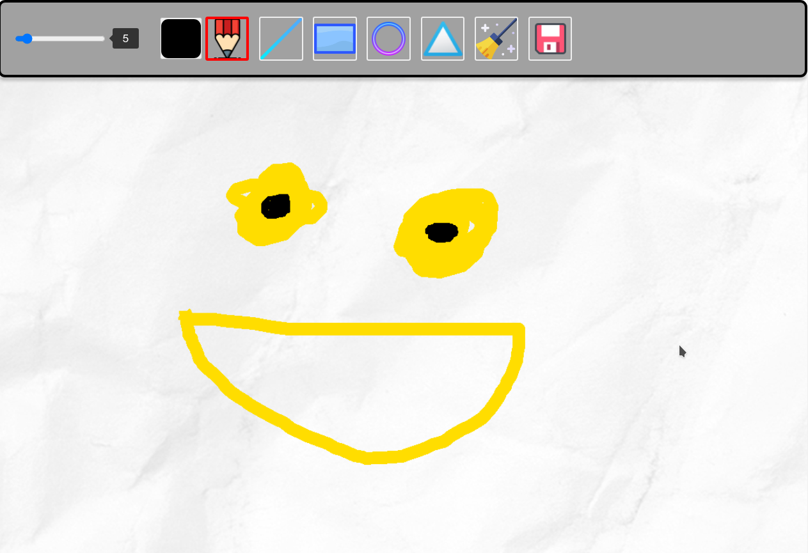

# WebPaint

## Table of contents
* [General info](#general-info)
* [Screenshots](#screenshots)
* [Technologies](#technologies)
* [Setup](#setup)
* [Features](#features)
* [Status](#status)

## General info
This is my version of paint in browser. You can make draw by it.

## Screenshots

## Technologies
* Javascript
* Canvas html
* CSS flexbox

## Setup
To open it just see its github pages.

## Features
List of features ready and TODO's for future development
* draw (pen mode)
* draw line
* draw rectangle
* draw circle
* clean
* save

To-do list:
* draw triangle
* erase
* undo
* redo

## Status
Project is: _in progres_
